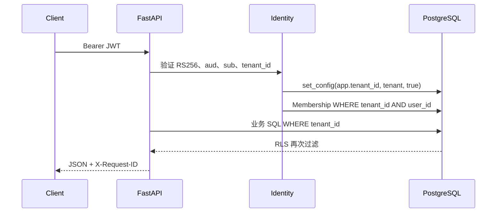
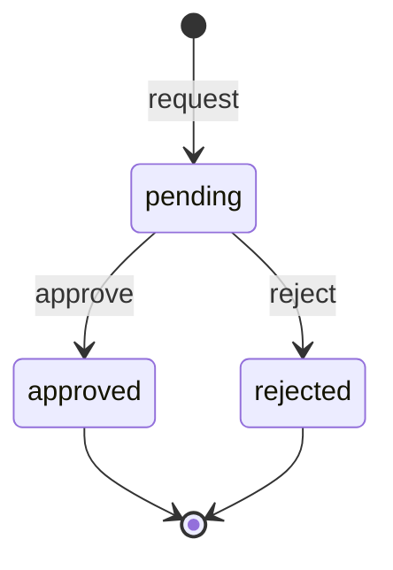
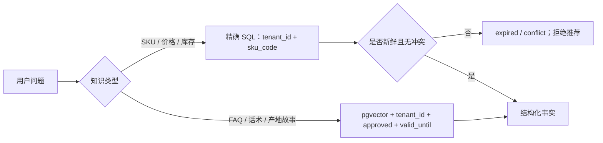
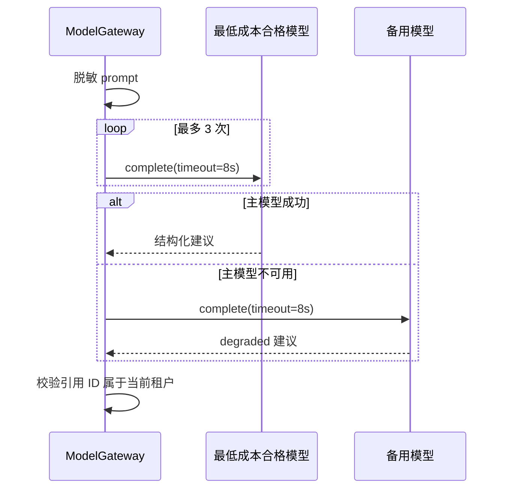

# 第 1–2 周基础架构

## 模块边界

- `identity`：租户、用户、成员关系、RS256 JWT 身份和封闭 RBAC。
- `audit`：请求关联、脱敏审计事件和数据库不可变触发器。
- `approvals`：五类高风险动作的请求与决定；不包含执行器。
- `knowledge`：商品精确事实、叙事知识和 pgvector 检索。
- `imports`：UTF-8 CSV 严格表头、逐行校验和合法行写入。
- `commerce`：平台端口与只读 `DouyinShopAdapterMock`。
- `model_gateway`：质量门槛、成本选择、超时重试、降级和引用校验。
- `apps/web`：Next.js 16.2 管理工作台。

模块化单体共享一个 PostgreSQL 数据库，但跨模块写入必须通过公开服务；任何外部平台写入都不能绕过审批边界。

## RLS 请求流程

应用层显式 `tenant_id` 与数据库 `FORCE ROW LEVEL SECURITY` 必须同时存在。租户上下文使用事务级 `set_config(..., true)`，事务结束即清除。

## 审批状态机

`refund`、`compensate`、`change_price`、`change_inventory`、`publish_douyin` 永远从 `pending` 开始，`requires_approval=true`。状态迁移只记录决定和审计事件，不触发退款、库存、价格或发布动作。

## 检索分流

商品事实不会进入向量召回。语义查询有类型白名单、审核状态和有效期条件。

## 模型选择与降级

只有事实错误率 `<2%` 且高风险召回率 `>=95%` 的模型可参与选择，合格集合内按每千 token 估算成本升序选择。

## 数据与审计约束

所有应用表包含 `created_at`、`updated_at`、`valid_until`、`audit_log`。独立 `audit_events` 保存 request ID、tenant、actor、action、entity、before/after；before/after 在写入前脱敏，数据库触发器拒绝更新和删除。

## 第 1–2 周明确不在范围

- 飞鸽消息自动读取或发送。
- 抖店 OAuth、回调验签和正式订单/售后 API。
- 退款、赔付、改价、改库存或抖音发布的真实执行器。
- 完整客服副驾、短视频 Agent、增长看板和复杂计费。
- `.xlsx` 二进制解析；用户需另存为 UTF-8 CSV。
